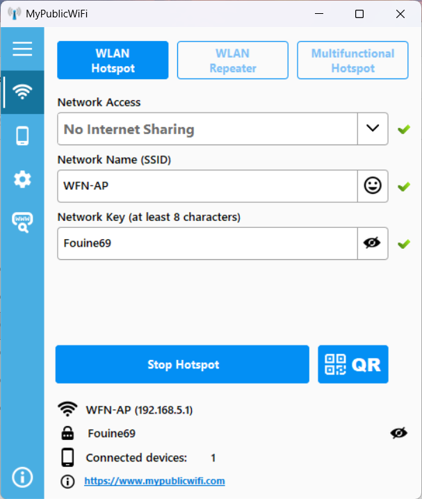

Sous windows pour configurer la carte wifi sans connexion internet, il faut installer MyPublicWiFi.exe:
https://mypublicwifi.com/downloads/MyPublicWiFi.exe

Installer puis lancer le soft, puis le paramétrer comme suit:

TODO: lancer automatiquement au démarrage

TODO: wfn-XXX.local pas reconnu sous windoze, ok sous macOS / iOS, à tester sous android / linux

